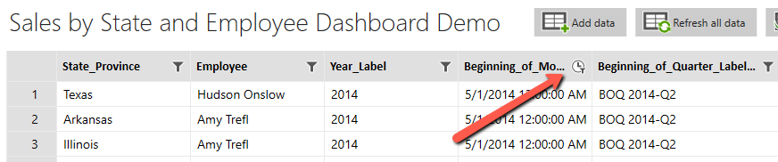
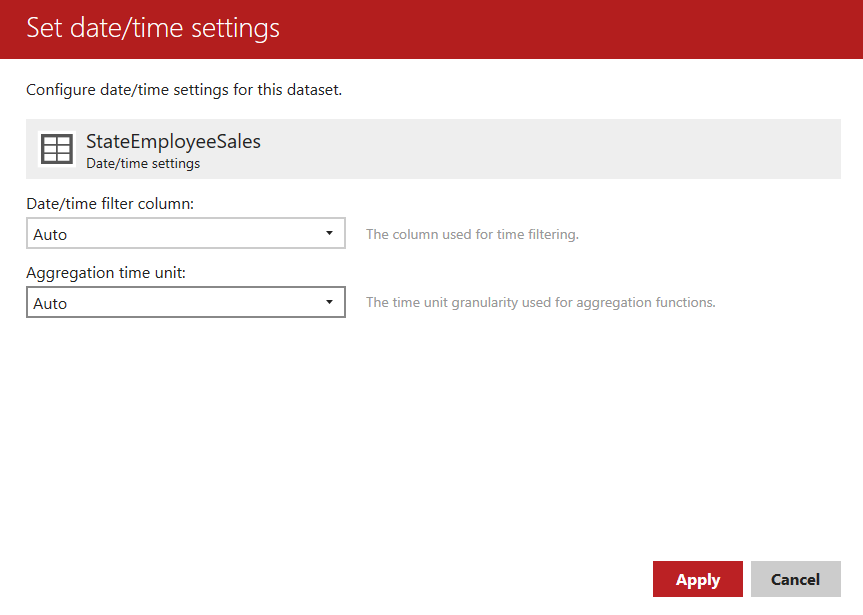

# Advanced Sales by State and Employee Dashboard - Adding data

## Introduction

First, if you've not done so to the Report Portal and use the New menu to create a new Mobile Report. This will be named **Sales by State and Employee**.

## Adding Datasets - State Employee Sales

In the report, switch to the _Data_ tab. Then click **Add Data**.

Pick the report portal as the source, and select State Employee Sales as the dataset to add.

Look at the data, specifically at the Beginning of Month column at the top.

The clock symbol indicates this is a Date/Time column. This is important, as one of the elements we will be using must have a Date/Time column to work from.

If you have multiple Date/Time columns, only one can be the primary. Click on the gear icon beside the State Employee Sales name at the bottom. In the circle that appears, one of the options reads _Dates_. Click on it.

Right now it reads _auto_ for both options, which for this report will be fine. The clock icon indicated the Beginning of Month will be the column it uses. You could however click the drop down to pick another field if you had multiple Date/Time columns.

Under _Aggregation time unit_ you can pick a different resolution, for example quaters or months. Again, for this report we'll leave it at **Auto**.

If we made changes we'd need to click _Apply_, but we can hit _Cancel_ in this case. With this I just wanted you to be aware of where these settings can be located.

## Adding Datasets - List - Employee

Click the _Add Data_ again. This time add the dataset **List - Employee**.

## Adding Datasets - List - State

Finally, click _Add Data_ one more time, and add the **List - State** dataset.

## Conclusion

That's it, just three datasets. The two List ones will be used to supply data to drop downs that will serve as filters.

All of the remaining report elements will be sourced from a single dataset, State Employee Sales.

This is an important concept. When you apply a filter to a dataset, all of the report elements bound to that dataset will have the filter applied. 

You'll see that in action once the dashboard has been created. For now move onto the next steps, [02-Building_the_Dashboard.md](02-Building_the_Dashboard.md).

---

## Author Information

### Author

Robert C. Cain | [@ArcaneCode](https://twitter.com/arcanecode) | arcanecode@gmail.com

### Websites

About Me: [http://arcanecode.me](http://arcanecode.me)

Blog: [http://arcanecode.com](http://arcanecode.com)

Github: [http://arcanerepo.com](http://arcanerepo.com)

LinkedIn: [http://arcanecode.in](http://arcanecode.in)

### Copyright Notice

This document is Copyright (c) 2021 Robert C. Cain. All rights reserved.

The code samples herein is for demonstration purposes. No warranty or guarantee is implied or expressly granted.

This document may not be reproduced in whole or in part without the express written consent of the author and/or Pluralsight. Information within can be used within your own projects.
