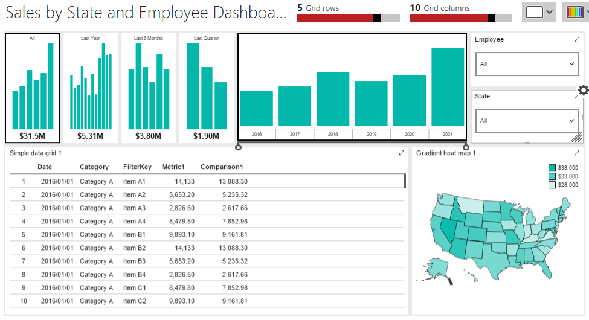

# Building the Advanced Dashboard

## Introduction

In this section, we'll quickly create the dashboard by adding the report elements to it.

If you've not done so, click in the title area and rename it to **Sales by State and Employee Dashboard**.

## Placing the elements

Here's our goal:

In the layout pane on the left, grab the _Time Navigator_, and drop it in the top right corner of the designer. Resize it to two blocks high by eight wide.

Now grab a _Selection list_ and place it in the top next to the time navigator. Leave it at one block high and but make it two wide.

While you are here, go to the _Visual properties_ at the bottom and change the Title to **Employee**. This will make it easier when we tie the selection list to a dataset in the next lesson.

Next, take another _Selection list_ and place it directly under the Employee one. Change the title to **State** and make it two wide.

The _Simple data grid_ comes next. Place one right under the time navigator. Size it to seven wide and three high.

The final control is a _Grandient heat map_. Place it beside the simple data grid, and make it three wide and high.

## Conclusion

That was fast and easy. In the next lesson we'll make the magic happen by linking the report components to the data, so proceed to 