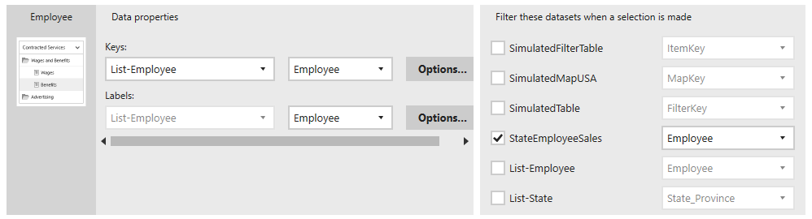
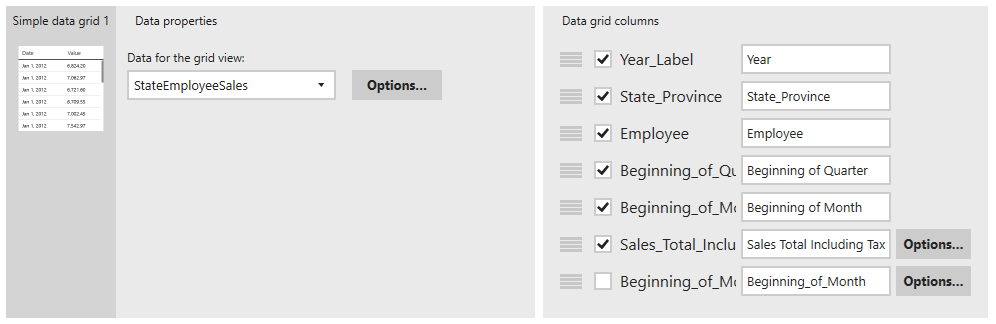

# Linking Report components

## Introduction

In this series of instructions, we'll see how to bind the controls on the report to the data that was imported in the first lesson, [01-Adding_Data.md](01-Adding_Data.md).

If you don't have it open, open up the dashboard in the Mobile Report Publisher. Then, switch to the Data tab.

## Selection lists

Let's start with the selection lists. Click on the _Employee_ element.

In the _Data Properties_ at the bottom, change the _Keys_ to **List-Employee**. Because this dataset only has one column, it is automatically populated in the box to the right.

On the very right is an area, _Filter these datasets when a selection is made_. Uncheck the SimulatedTable, then put a check beside **StateEmployeeSales**. In the drop down beside it, change the value to **Employee**.

Your result should look like:

Now we'll repeat the same steps for the State selection list. Click on the State element on very left.

In the Data Properties change the _Keys_ to **List-State**. Verify the column box to the right now reads **State_Province**.

Finally, in the filter datasets area, uncheck the SimulatedTable, check the **StateEmployeeSales**, and verify the column beside it reads **State_Province**.

## Time Navigator_

Still on the data tab, click on the Time Navigator. Change the _Series for background chart_ to **StateEmployeeSales**. For the metric, make sure it is set to the **Sales_Total_Including_Tax** column.

Go ahead and click the _Options_ button. At the top it will read _Filtered by_ and show Employee and State. This is what we want! But it shows how the selection list filters are connected to the time navigator.

## Simple Data Grid

Now click on the Simple Data Grid in the Report Elements area. Change the _Data for grid view_ to our **StateEmployeeSales** dataset. Click on the _Options_ button beside it.

At the top, under _Filtered by_, you'll see the Employee and State, but you'll also see the time navigator. The time navigator does double duty. First, it provides us valuable information. But, when you click on a time range in it, it will act as a filter for the dataset, affecting the simple data grid and (soon) the gradient heat map.

Now we need to clean up the data grid columns to the very right.

Start by dragging the Year_Label to the top, using the four bar handle to its left. The text box on the right is the text the end user will see as a header in the data grid. Let's change it to just read **Year**.

State_Province is next, but since we only have states lets rename it to just **State**.

The Employee should be next, and its text is fine.

The next field in the list is our Date/Time column, _Beginning_of_Month_. While we have to have this for the time navigator to work, we don't have to display it to the user.

Uncheck the box beside it. While it's not necessary, for organization I like to move hidden fields to the very bottom, so drag this to the bottom of the list.

The next two columns are our beginning of quarter and month labels. Change the text beside these to just **Beginning of Quarter** and **Beginning of Month** respectively.

Finally is the _Sales_Total_Including_Tax_. For the column header, simply remove the underscores, changing them to spaces.

Then, click on the _Options_ button beside it. Change the string format to **Currency**, and click _Done_. Your properties should now look like:

## Gradient Heat Map

The last element to configure is the gradient heat map. Click on it in the report elements area. In the data properties, change the _Keys_ to our **StateEmployeeSales** dataset.

Click on the _Options_ beside it. In the options, the time navigator should be checked on, with Employee and State unchecked.

In this case having State checked doesn't make much sense. The user acts as a filter by clicking on a state in the map.

However, it does make sense to add Employee as a filter, so you can see sales for a single employee on the map.

So in the options, add a check beside **Employee**, make sure **Time Navigator** is checked, and leave **State** unchecked.

Beside it, the field should automatically change to the **State_Province**. In the values, verify it is set to our **Sales_Total_Including_Tax**.

## Conclusion

Connecting up all of the data to the elements, and ensuring filtering is configured correctly, is the hardest part of the job.

In the next lesson we'll clean up the report by setting titles and other properties. See how in [04-Cleaning_Up.md](04-Cleaning_Up.md).

---

## Author Information

### Author

Robert C. Cain | [@ArcaneCode](https://twitter.com/arcanecode) | arcanecode@gmail.com

### Websites

About Me: [http://arcanecode.me](http://arcanecode.me)

Blog: [http://arcanecode.com](http://arcanecode.com)

Github: [http://arcanerepo.com](http://arcanerepo.com)

LinkedIn: [http://arcanecode.in](http://arcanecode.in)

### Copyright Notice

This document is Copyright (c) 2021 Robert C. Cain. All rights reserved.

The code samples herein is for demonstration purposes. No warranty or guarantee is implied or expressly granted.

This document may not be reproduced in whole or in part without the express written consent of the author and/or Pluralsight. Information within can be used within your own projects.

