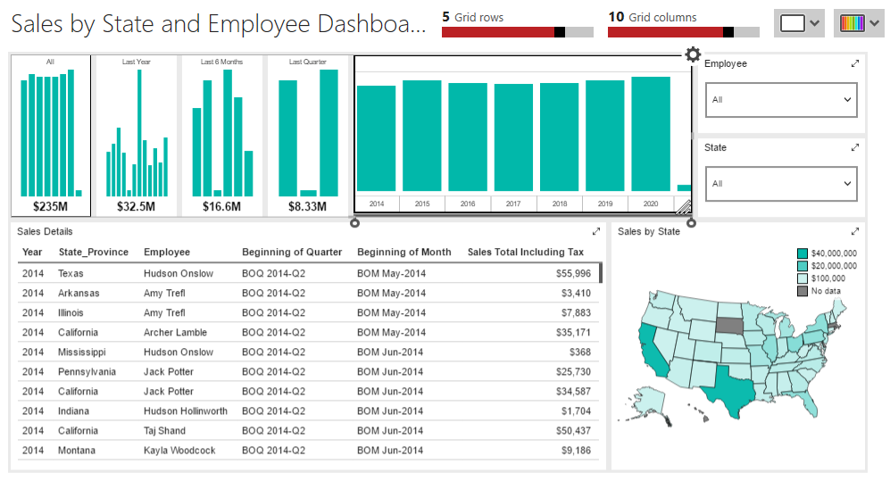

# Cleaning Up the Dashboard

In this section we'll go through the various elements on the dashboard, as well as the dashboard itself, and add the finishing touches to make it look like a completed, professional report.

First, you obviously need the report open in Mobile Report Publisher. Then make sure you are on the _Layout_ tab.

If you've not done so, click in the top area and rename the report to **Sales by State and Employee Dashboard**.

## Time Navigator

Unlike most other elements, the Time Navigator does not have a Title property, so there's nothing to update as far as that goes.

However, it does have a _Time Levels_ property. Click the drop down, and it will display additional date levels besides the default of Years and Months. Since we also have a Quarter level in our data, put a check beside the Quarter.

Next, because of the large amounts, the tops of the bars are fairly close together. If you remember, the category chart in the basic dashboard had a similar issue. We'll solve this the same way by turning on the _Adjust Y range to values_ property.

Finally, you may want to go to the _Visualiztion type_ and see what other types are supported, but for this report we'll stick to the default of **Bar**.

## Employee and State

For our selection boxes, we won't be making any changes for our report. However there are a few properties I wanted to point out.

The _Allow multiselect_ does just what is says, it will allow a user to pick multiple items in the drop down.

In most cases you want to leave _Allow select all_ turned on, so your dashboard can run for all data. However there may be times when it may make no sense to return all data, you only want the report for specific items.

In addition, you can also change the label used for All. For example, you could use _All States_ or _All Employees_.

## Simple Data Grid

For this element we'll only change two properties. First, set the title to **Sales Details**.

Next, go over to the _Row numbers_ and change it from Auto to **Hide**.

## Gradient Heat Map

Our final element only needs one change, update the title to read **Sales by State**.

With that set, don't forget to save your dashboard.

## Conclusion

If all went well, your report should now look like:

With our cleanup done, we can proceed to the next lesson, [05-Tablet.md](05-Tablet.md), in which we'll create the tablet version of our dashboard.

---

## Author Information

### Author

Robert C. Cain | [@ArcaneCode](https://twitter.com/arcanecode) | arcanecode@gmail.com

### Websites

About Me: [http://arcanecode.me](http://arcanecode.me)

Blog: [http://arcanecode.com](http://arcanecode.com)

Github: [http://arcanerepo.com](http://arcanerepo.com)

LinkedIn: [http://arcanecode.in](http://arcanecode.in)

### Copyright Notice

This document is Copyright (c) 2021 Robert C. Cain. All rights reserved.

The code samples herein is for demonstration purposes. No warranty or guarantee is implied or expressly granted.

This document may not be reproduced in whole or in part without the express written consent of the author and/or Pluralsight. Information within can be used within your own projects.
s