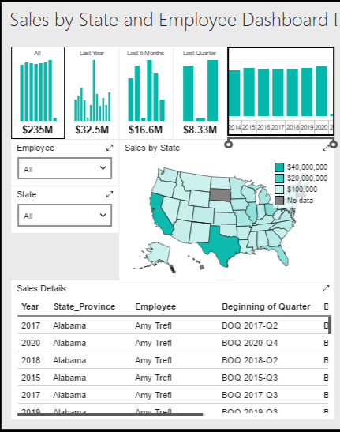

# Building the Tablet Report

## Introduction

In this section we will take our dashboard and reformat it for the tablet. Naturally start with the dashboard open in Mobile Report Publisher.

## Designing the Tablet Report

On the _Layout_ tab, look in the upper right corner. You'll see a white box attached to a drop down. Click it, and change to _Tablet_.

Your dashboard designer will now update. On the left you will see the existing Report Elements. In the middle is a grid square, 8 rows by 6 columns (by default).

Take the time navigator and place it in the very upper left. Now expand it to two high by six wide.

Right under it place the Employee selector, and make it one high by two wide.

Next, place the State selector under Employee, making it one high by two side as well.

To the right of the Employee selector, place the gradient heat map. Make it four wide by three high.

This will leave a one high by two wide gap under the state selector. That's OK, you are allowed to have unused space on your dashboard if that makes for a good user experience.

Under that, drop the simple data grid. Expand so it is three high by six wide.

Save your work and preview, the output should look like:

## Conclusion

We're getting close! Let's wrap things up in our next lesson where we'll layout the phone design in [06-Phone.md](06-Phone.md).
---

## Author Information

### Author

Robert C. Cain | [@ArcaneCode](https://twitter.com/arcanecode) | arcanecode@gmail.com

### Websites

About Me: [http://arcanecode.me](http://arcanecode.me)

Blog: [http://arcanecode.com](http://arcanecode.com)

Github: [http://arcanerepo.com](http://arcanerepo.com)

LinkedIn: [http://arcanecode.in](http://arcanecode.in)

### Copyright Notice

This document is Copyright (c) 2021 Robert C. Cain. All rights reserved.

The code samples herein is for demonstration purposes. No warranty or guarantee is implied or expressly granted.

This document may not be reproduced in whole or in part without the express written consent of the author and/or Pluralsight. Information within can be used within your own projects.
