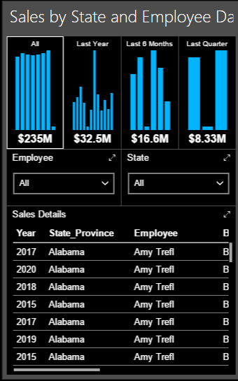

# Building the Phone Report

## Introduction

In this section we will take our dashboard and reformat it for the phone. Naturally start with the dashboard open in Mobile Report Publisher. If you've not done so, use the white box drop down in the upper right side of the report to switch to Phone mode.

## Designing the Phone Report

Start with the time navigator. Place it in the top left corner, and expand to two high by four wide.

Under it place the Employee selector, make it one high and two wide.

The State selector should go next to it, also one high and two wide.

Finally the Sales Details should take up the remaining space.

For this dashboard we will not be using the gradient heat map, due to a lack of usable space.

## Choosing a Color Theme

Use the white box drop down to return to the main dashboard design.

Next to it is a color bar drop down. Using it you can select from many color palettes for your report. For this demo I'm going to scroll to the bottom and pick one named **Tech**, but you are free to choose one that closely aligns to your company color scheme, or of course just use the default one.

Use the white box drop down to rotate to the phone and tablet layouts, and you'll see the color theme carries through to all of them.

One word of advice, pick a color theme with the assistance of your customers, then use that same theme for all of your dashboards from now on. That will give your dashboards a consistent look and feel.

Save your work, then hit Preview. Here is the final phone dashboard with the Tech theme applied.

## Conclusion

Congratulations, you've now completed the advanced dashboard!

Well, almost. There is one more optional step. Dashboard have the ability to "Drill Through" to a another dashboard, or a website. You can use this to launch a SSRS Paginated Report. In the next lesson, [07-Drillthru.md](07-Drillthru.md), you'll see how to do it.
