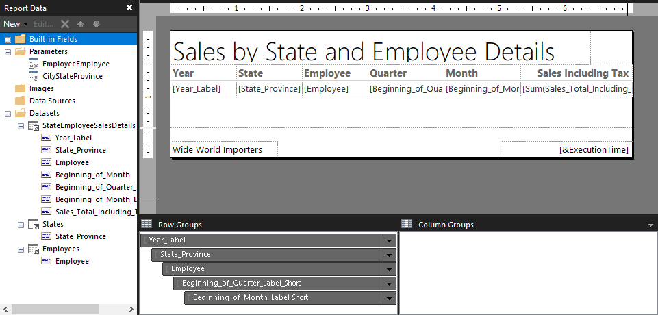
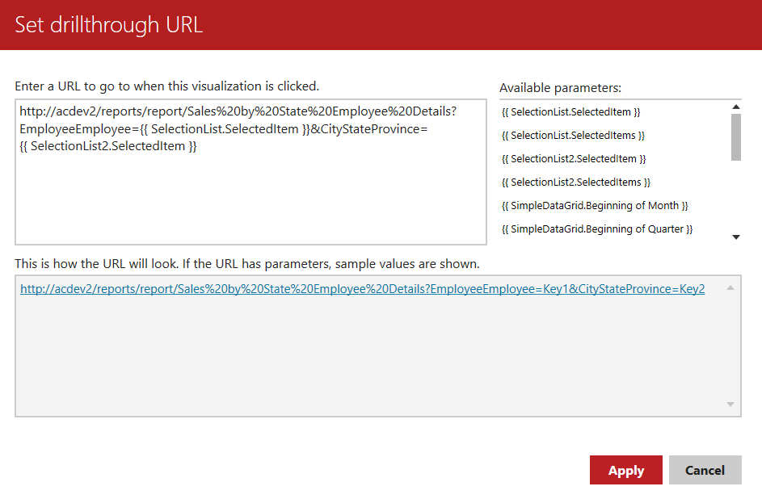

# The Drillthrough Feature in Dashboards

## Introduction

Many of the report elements in Mobile Report Publisher have the ability to **Drillthrough**. With this feature, clicking on the report element activates the ability. With it you can open up another dashboard, or you can launch a URL.

This flexible approach gives many capabilities. For example, you could add a drillthrough URL on your gradient heat map that opens up a map on your company website that lists all of its sales offices.

In our case, we are going to use it to launch a **Paginated Report**. These are part of the SQL Server Reporting Services reports, and are designed to be printed out as opposed to dashboards, which are intended for screen viewing.

## The Report

The steps to create the paginated report are beyond the scope of this Pluralsight course, however a copy of the report has been included in the downloads. We will provide a brief overview below.

First, we indicated we wanted a Table/Matrix style report.

When prompted, we selected the [State Employee Sales Details](../Datasets/../Advanced_Sales_by_Employee_State/07-Drillthru.md) as our dataset.

Next, into the Row Groups area we put the following fields:

* Year_Label
* State_Province
* Employee
* Beginning_of_Quarter_Label_Short
* Beginning_of_Month_Label_Short

In the value area, we put the Sales_Total_Including_Tax.

We did _not_ use the Beginning_of_Month on the report.

Some cleanup came next, starting with the addition of a title. The column headers were cleaned up as shown, and all but the sales including tax were left aligned. We then accessed the properties of the sales including tax value and set its  number format to currency, no decimals, and include the thousands separator.

Finally, we added a text box in the lower left with the title of our company, Wide World Importers.

On the left, you will note two parameters, `EmployeeEmployee` and `CityStateProvince`. Recall in the creation of the State Employee Sales Details dataset we created two parameters. Report Builder found those, and automatically added them as parameters in the report.

However we don't want to force the users to type them in each time, so we added two more datasets. The first used _List - Employee_, the second _List - State_. We then opened up each parameter and indicated we should use these as their _Available Values_.

This way a user can launch the report directly in the Report Portal, select the Employee and State in the parameter drop down, and execute the report.

## Creating a Drillthrough

It's time to create a drillthrough in our dashboard. If you've not done so, open the _Sales by State and Employee Dashboard_ in Mobile Report Publisher. Next, click on the _Sales Details_ report element.

In the properties area, click on _Drillthrough target..._. Here is what the completed dialog looks like:

First, we need the URL for the paginated report we created above. The easiest way to get it is to just run the report in the Report Portal, then go to the address bar in your web browser, copy it and paste into the top text box.

Next, we want to add the parameters so when the report runs it will be for the same employee and state on the dashboard. To pass a parameter into a paginated report via the URL, start by putting a question mark `?` at the end of the URL, followed by a parameter name. Here we're using `EmployeeEmployee` first, although the order is not important.

We then add an equal sign, then tell it where to get it from. Here we want to get the value in the first SelectionList report element, which is our Employee selector. Just click on `{{ SelectionList.SelectedItem}}` and it will add it to the URL box.

Now we can append the second parameter using an ampersand `&` at the end of the URL, then the parameter name `CityStateProvince`. The state province is found in the second selection list, so after appending an equal sign double click on the `{{ SelectionList2.SelectedItem}}`.

When done correctly, your URL should resemble the one shown in the upper left box, except of course your URL should point to your report server and not my `acdev2`. The dialog even displays a sample of what the URL will look like in the box at the bottom.

When done, just click `Apply`.

## Testing the Drillthrough

In the Mobile Report Publisher, you can click the **Preview** tab. Select an Employee and State in the dashboard, then click on the sales details. When you do, your default browser should open up and display the paginated report with the data for the selected employee and state.

## One Issue

As this is designed, there is one problem. You can not launch the report if the employee and state selection lists are set to the default of **All**. This requires a bit of extra work, but is possible. Because of the scope of the extra work, we'll save it for a future course on Report Builder.

## Conclusion

As you can see, creating a Drillthrough is not horribly complicated. A scenario can easily be imagined where a manger is reviewing the sales details for an employee, and wants to get a printed version to share with that employee.

That's just one use, as stated in the introduction the flexibility of using any URL means not just paginated reports can be called, but any URL. For example, you might have a link to one of your companies web based business applications.

The use for Drillthrough targets is only limited by your imagination.
---

## Author Information

### Author

Robert C. Cain | [@ArcaneCode](https://twitter.com/arcanecode) | arcanecode@gmail.com

### Websites

About Me: [http://arcanecode.me](http://arcanecode.me)

Blog: [http://arcanecode.com](http://arcanecode.com)

Github: [http://arcanerepo.com](http://arcanerepo.com)

LinkedIn: [http://arcanecode.in](http://arcanecode.in)

### Copyright Notice

This document is Copyright (c) 2021 Robert C. Cain. All rights reserved.

The code samples herein is for demonstration purposes. No warranty or guarantee is implied or expressly granted.

This document may not be reproduced in whole or in part without the express written consent of the author and/or Pluralsight. Information within can be used within your own projects.
