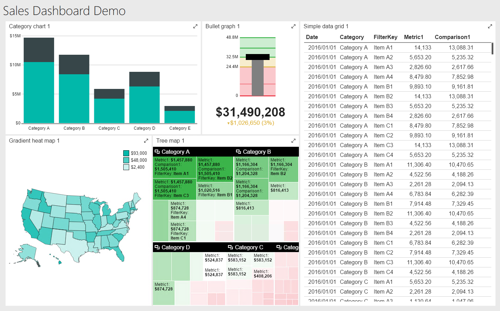

# Basic Sales Dashboard - Building the Dashboard

## Introduction
In this tutorial, you will see how to add the components to the dashboard to get the following results.

In the SQL Server Report Portal, click the + New menu, then in the drop down click Mobile Report. When prompted click OK to let the server open the application.

## Category Chart

Let's start in the upper left. In the list of dashboard components on the left, scroll down to the charts. Click on the **Category Chart**, drag and drop in the the very top left square. Now click on the sizer handle on the lower right corner and drag it so the category chart is two blocks high by four blocks wide.

## Bullet Graph

Next, scroll up a little to the Gauges area. Click on the **Bullet graph** and drop it on the top row, right next to the Category Chart. Then expand it to be two blocks wide by two blocks high.

## Simple Data Grid

Now we need to add the listing on the very right. Scroll down in the list of controls to the Data grids. Drag and drop the **Simple data grid** on the top row, next to our bullet graph. Then expand so it is four blocks wide and five high, taking up the entire right side of the dashboard.

## Gradient Heat Map

One of my favorite controls is the map. Move to the Maps section, grab the **Gradient heat map**, and place it on the left side of the dashboard, just under the Category chart. Expand it so it is three blocks wide by three blocks high.

## Tree Map

Our final control is the **Tree map**, found in the Charts area. Drag it next to the Gradient heat map and resize so it takes up the remaining area.

If all went well, your dashboard should look like the sample at the top of this page.

## Preview

If you want, you can click on the Preview button and interact with the report. Be aware this is all bogus or "fake" data that the Mobile Report designer supplies so you can get an idea of how your dashboard works.

When you are done, there is a left arrow with a circle around it in the top right, just click it to return to the designer.

## Save Your Work

Now is a good time to save your work so far. Click on the save icon, the thing that looks like a floppy disk (not that anyone has seen a floppy disk in 20 years).

When prompted, select the Save to server option. Give your report the name of Sales Dashboard. Make sure your server is selected.

Under Location you'll pick where to store your report. Many report servers have setup folders, for example by department. You can use the Browse button to navigate to the location.

If you are working like I am, on a local instance of SQL Server running on your own computer, you can just take the default folder of / (a single slash mark) which indicates the top most folder of your Report Portal.

## Conclusion

At this point you can close the Mobile Report builder, then return to edit later, or go on to the next step in which you'll add the data. You'll find those instructions in the file [02-Adding_Data.md](02-Adding_Data.md)
---

## Author Information

### Author

Robert C. Cain | [@ArcaneCode](https://twitter.com/arcanecode) | arcanecode@gmail.com

### Websites

About Me: [http://arcanecode.me](http://arcanecode.me)

Blog: [http://arcanecode.com](http://arcanecode.com)

Github: [http://arcanerepo.com](http://arcanerepo.com)

LinkedIn: [http://arcanecode.in](http://arcanecode.in)

### Copyright Notice

This document is Copyright (c) 2021 Robert C. Cain. All rights reserved.

The code samples herein is for demonstration purposes. No warranty or guarantee is implied or expressly granted.

This document may not be reproduced in whole or in part without the express written consent of the author and/or Pluralsight. Information within can be used within your own projects.
