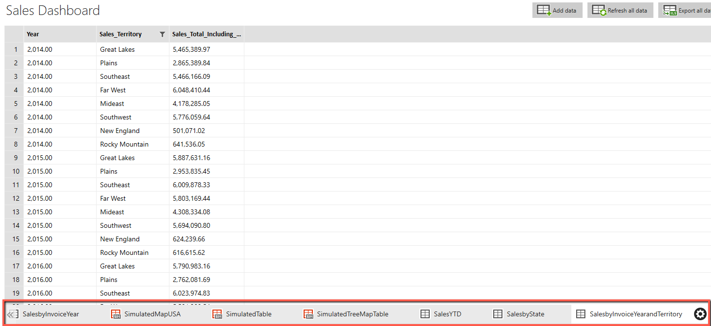

# Basic Sales Dashboard - Adding data

## Introduction

If you still have the Sales Dashboard open in the Mobile Report designer, great you are ready to proceed.

If not, return to your Report Portal and find the **Sales Dashboard**. (If you saved it in the previous set of steps then closed the designer, you may have to do a refresh on the Report Portal web page to make it appear.)

Find the Sales Dashboard, and click on the three dots in the upper right. This will cause a menu to appear. In it pick Edit in Mobile Report Publisher.

## A note on building reports

For this file, we'll add data in two stages. First, we will add all of the datasets we'll need. In the next stage, we will bind the dataset to the report components we placed on the designer in the previous file.

There is no requirement to do it this way, however. We could place a report component, such as a category chart, on the designer. Then we could add a dataset, and finally link that dataset to a component. 

Mobile Report Publisher is totally flexible in the sequence in which you create your reports. 

## Adding Data

### Overview

The opening steps for adding a dataset are the same no matter which dataset we are adding. Thus we'll cover those steps once, then in following sections provide instructions on each dataset.

Begin by clicking on the **Data tab**, in the upper left of the designer. Then click on the **Add Data** icon in the upper right.

Next, for this course we'll always get data stored on the report server, so click on the **Report server** option.

Now select the server. This will show a list of available servers, select yours from the list. Here I'll use my local acdev2 server, but obviously you'll need to pick the one you are using.

Note that it will default to the report server you launched the Mobile Report Publisher tool from.

Now you are presented with a list of available datasets found on the Report Server.

In these examples all of them are stored in the root of my report server, but if I had folders you would see them and navigate down through them to where your datasets are stored.

In the following sections you'll just be instructed to add the "xyz" dataset. These are the steps you'll need to find the specific dataset. Click on it to add it to your dashboard.

### Add Data - Sales by Invoice Year

In the _Add data from server_ dialog, click on the Sales by Invoice Year dataset.

Once added, you'll see a sample of the data. Note it is in a tab beside the "bogus" datasets provided by the Mobile Report Publisher.

### Add Data - Add remaining datasets.

Using the same steps above, add the remaining datasets to your report:

* Sales YTD
* Sales by State and Invoice Year
* Sales by State
* Sales by Invoice Year and Territory

## Conclusion

When done, you should now see all the datasets across the bottom, along with the simulated datasets provided by the Mobile Report Publisher.

You are now ready to move onto the next section, linking the report components to the data, in [03-Linking_Report_Components.md](03-Linking_Report_Components.md).
---

## Author Information

### Author

Robert C. Cain | [@ArcaneCode](https://twitter.com/arcanecode) | arcanecode@gmail.com

### Websites

About Me: [http://arcanecode.me](http://arcanecode.me)

Blog: [http://arcanecode.com](http://arcanecode.com)

Github: [http://arcanerepo.com](http://arcanerepo.com)

LinkedIn: [http://arcanecode.in](http://arcanecode.in)

### Copyright Notice

This document is Copyright (c) 2021 Robert C. Cain. All rights reserved.

The code samples herein is for demonstration purposes. No warranty or guarantee is implied or expressly granted.

This document may not be reproduced in whole or in part without the express written consent of the author and/or Pluralsight. Information within can be used within your own projects.
