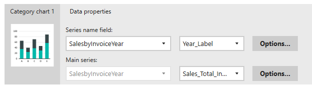

# Linking Report components

In this series of instructions, we'll see how to bind the controls on the report to the data that was imported in the previous file [02-Adding_Data.md](02-Adding_Data.md).

If you don't have it open, open up the dashboard in the Mobile Report Publisher.

## Category Chart

Start on the data tab of the Mobile Report Publisher. Click on the **Category chart 1** control on the left under Report Elements.

Underneath the data is a panel. The Category chart element should show on the left. To the right is where the properties for this control are set.

For the Series name field, use the drop down to pick the Sales by Invoice year data set. Mobile Report Publisher will analyze the dataset, and automatically assign the only text field, the Year Label, to the series name.

The series name will be the value charted across the bottom of the chart, the X axis.

The tool then finds the numeric value in the dataset, Sales Total Including Tax, and uses that for the main series value. This is the value that is used on the Y axis of the chart.

If the dataset had more than just two fields, you could use the drop downs to select other fields to use in the dataset.

## Bullet Graph

Next, click on the Bullet graph report element. In the main value, use the drop down to select the Sales YTD dataset. In the field selector to the right, make sure Invoice Sales Total Including Tax YTD is selected.

Now in the Comparison Value, also select the SalesYTD for the source dataset. In its field drop down, pick Invoice Sales Total Including Tax Previous YTD.

A subtle but important point, we can draw the comparison values from two different datasets if we need to. In this case however both values are derived from the same dataset.

## Simple Data Grid

In Report Elements, we'll now work on the Simple data grid.

In the _Data for the grid view_, select Sales by State and Invoice Year for the dataset. 

Over to the right you will see the _Data grid columns_. This defines what we will see, and in what order in the grid.

Click on the bars to the left of Year_Label, hold, and drag it to the top.

To the right of the field names are the same names but in editable text boxes. These will be the text the user sees at the top of the data grid. Update the _Year_Label_ box to just read **Year**.

Now update the next two boxes to remove any underscores, replacing them with spaces.

Finally, click on the _Options_ button beside the Sales Total Including Tax box. Change the String format to _Currency_.

## Gradient Heat Map

We'll now turn our attention to the gradient heat map. Change the _Keys_ to the **Sales by State** dataset.

When you do, it will analyze the dataset. It should find geographic data in the State_Province column and automatically put that into the drop down beside the keys selector.

Report Publisher then saw Sales Total Including Tax as the only other field and placed that into the Values area.

Naturally if your dataset had more fields you could change these selections as needed.

## Tree Map

In the Size Represents, select the Sales by Invoice Year and Territory dataset. The drop down beside it should auto populate with the only numeric field it has, Sales Total Including Tax.

Next to it in Group by, select Year_Label.

Underneath it is the **Custom center value**. Change the drop down to the same Sales by Invoice Year and Territory dataset. The center value should automatically select the Sales Total Including Tax.

Now you may need to scroll to the right to find the _Popup labels_ area. If you click the drop down, you'll see all of the fields in your dataset. These will appear in the pop up window. Since there's only a few, go ahead and put check boxes by all of them, obviously if you had a lot of fields you should be very selective about what is displayed.

## Conclusion

Save your work, then click the Preview button. Your dashboard should now be populated with data.

Looking good so far, in the next step, [04-Cleaning_Up.md](04-Cleaning_Up.md) we will work on cleaning up the report.
