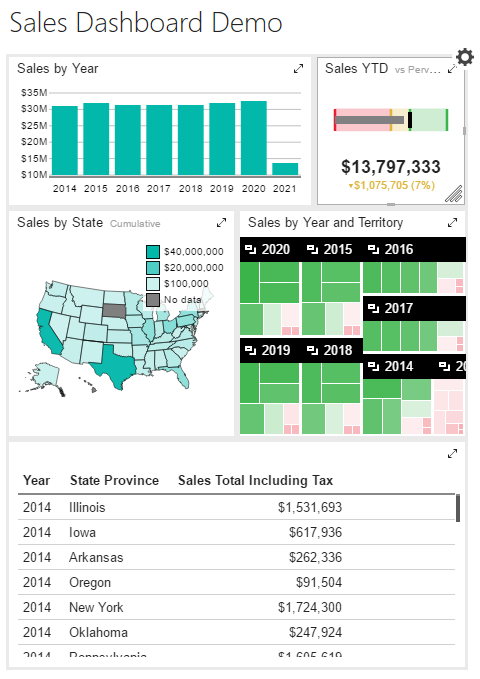

# Building the Tablet Report

## Introduction

In this section we will take our dashboard and reformat it for the tablet. Naturally start with the dashboard open in Mobile Report Publisher.

## Designing the Tablet Report

On the _Layout_ tab, look in the upper right corner. You'll see a white box attached to a drop down. Click it, and change to _Tablet_.

Your dashboard designer will now update. On the left you will see the existing Report Elements. In the middle is a grid square, 8 rows by 6 columns (by default).

Start by dragging and dropping the Sales by Year element onto the dashboard. Position it so it is in the very upper left corner, and drag it out so it is two high and four wide.

Do note as you place each element on the designer, it will disappear from the Report Elements pane on the left side of the Mobile Report Publisher.

Now grab the bullet graph, and place it in the upper right corner beside the Sales by Year, make it two by two in size.

Next, place the gradient heat map under the category chart. Make it three by three in size.

Beside the gradient heat map, place the tree map. Also make it a three by three size.

Finally place the simple data grid at the bottom, and let it take up the remaining space. When done it should look like:

## Conclusion

Click on the Preview tab to get an idea of how the tablet version of the report works. Note how you can use the mouse to trigger a pop up, just as on the regular dashboard. On a tablet of course, this would happen using a finger or a stylus.

You are now ready to proceed to the final step, designing for the phone, found in [06-Phone.md](06-Phone.md).
