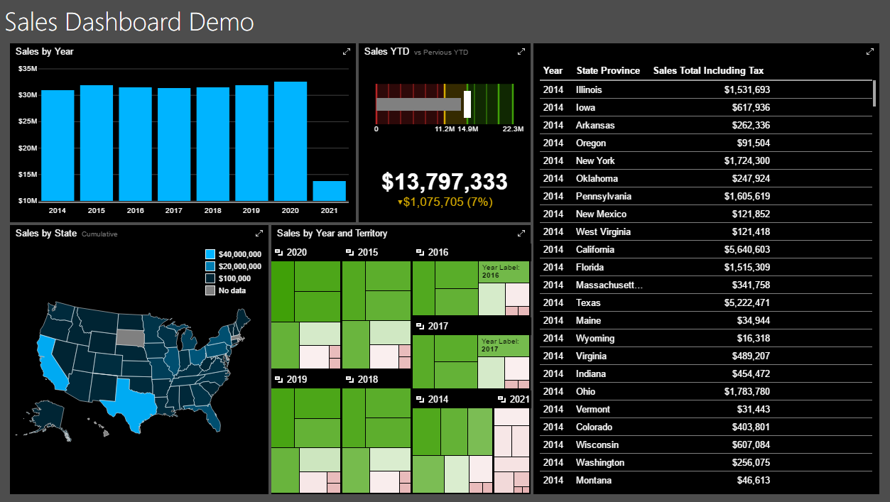

# Building the Phone Report

## Introduction

In this section we will take our dashboard and reformat it for the phone. Naturally start with the dashboard open in Mobile Report Publisher. If you've not done so, use the white box drop down in the upper right side of the report to switch to Phone mode.

## Designing the Phone Report

Start by placing the Sales by Year category chart, and placing it in the upper right corner. Make it two high and four wide.

Next, take the Sales by State heat map and drop it under the chart. Make it two high by three wide.

Now take the Sales YTD bullet graph, and put it beside the heat map, making it one wide and two high.

Finally, place the simple data grid at the bottom, making it two high and four wide.

But what about the tree map you ask? There's no room left for it!

You are correct. In fact, the tree map is a bit too small to use easily in a phone sized dashboard, at least for our report. Yours of course may be different.

The main lesson here though is you are not required to use all report elements on the tablet or phone layouts. If it made sense, we could have just used the category chart and the simple data grid, and omitted the other three.

Work with your customer (be it an internal or external one) and decide which elements are the most important to display and focus on those.

Here is the design for the phone.

## Choosing a Color Theme

Use the white box drop down to return to the main dashboard design.

Next to it is a color bar drop down. Using it you can select from many color palettes for your report. For this demo I'm going to scroll to the bottom and pick one named **Tech**, but you are free to choose one that closely aligns to your company color scheme, or of course just use the default one.

Use the white box drop down to rotate to the phone and tablet layouts, and you'll see the color theme carries through to all of them.

One word of advice, pick a color theme with the assistance of your customers, then use that same theme for all of your dashboards from now on. That will give your dashboards a consistent look and feel.

Here is the final dashboard with the Tech theme applied.

## Conclusion

Congratulations, you've now completed the basic dashboard.

You are now ready to proceed to building the Advanced Dashboard.
---

## Author Information

### Author

Robert C. Cain | [@ArcaneCode](https://twitter.com/arcanecode) | arcanecode@gmail.com

### Websites

About Me: [http://arcanecode.me](http://arcanecode.me)

Blog: [http://arcanecode.com](http://arcanecode.com)

Github: [http://arcanerepo.com](http://arcanerepo.com)

LinkedIn: [http://arcanecode.in](http://arcanecode.in)

### Copyright Notice

This document is Copyright (c) 2021 Robert C. Cain. All rights reserved.

The code samples herein is for demonstration purposes. No warranty or guarantee is implied or expressly granted.

This document may not be reproduced in whole or in part without the express written consent of the author and/or Pluralsight. Information within can be used within your own projects.
