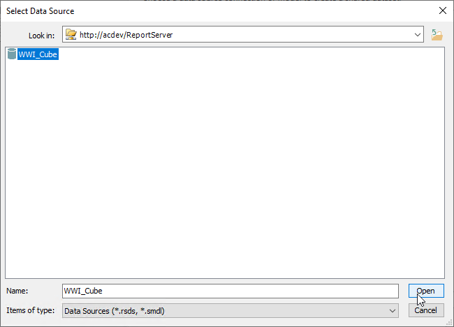

# Data Sources and DataSets

## Introduction

This folder contains the instructions for creating each of the individual datasets for this course's demos.

## Data Sources

The source for all of the projects is the Wide World Importers Tabular Cube, included in the demo download for this Pluralsight course. Begin inside the SQL Server Reporting Services Report Portal, then click the + New button. In the drop down menu, select Data Source.

Name the new Data Source WWI_Cube, then fill in the following details with these vales:

| Property | Value |
| ----- | ----- |
| Description | Wide World Importers SSAS Tabular Cube |
| Hide this Item | Unchecked |
| Enable this data source | Checked |
| Connection Type | Microsoft SQL Server Analysis Services |
| Connection String | Data Source=localhost;Initial Catalog=WWI-SSAS-Tabular |
| Credentials | As the user viewing the report |

Note, we are assuming you are running SSRS on the same computer you are working on, as in a development situation. If your SSRS server is a different computer, change the localhost in the Connection String property to the name of the server.

You may also need to alter the Credentials setting based upon your situation. Check with your system administrator for further clarification.

Once done, click the Test Connection button to ensure you've entered the values correctly. Once it connects successfully, click the Apply button.

## Steps

For all of these, the process is the same. In the Report Portal, click the + New in the toolbar, then pick Dataset. It will attempt to open Report Builder, let it open it.

When Report Builder launches it will ask you for the data source. If you have previously used the WWI_Cube, it will show in the list. You can simply select it, then click the Create button on the lower right.

If it does not exist in the list, click the Browse other data sources... link toward the bottom.

In the Select Data Source window, the Look in: field should be pointed at your SSRS reporting server. If not use the link folder icon on the right to find it.

It will now show a list off all the available data sources. Pick the WWI_Cube then click Open.

With the source selected, click the Create button in the lower right.

At this point you are presented with the empty query designer. From this point follow the instructions for each dataset, located in their own markdown files. They will assume you've followed these steps and are at an empty query designer.
