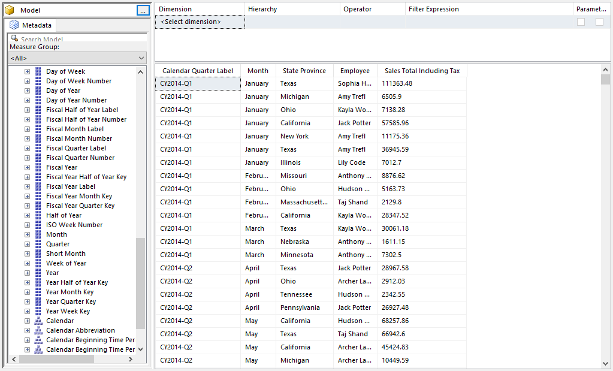

# Sales Data by Quarter Year State and Employee

## Introduction

These instructions walk you through the creation of the Sales Data by Quarter Year State and Employee dataset.

## Build the Query

Expand the **Sales Invoice Date** branch.

Find the member **Calendar Quarter Label** and drop it into the query designer.

Still in the Sales Invoice Data dimension, find the **Month** and drop it to the right of the Calendar Quarter Label.

Next, expand the **City** branch. Drag the **State Province** to the end of the query designer.

The Employee is needed next, expand the **Employee** branch and drop the **Employee** member onto the query designer.

Finally, in the **Measures** area, expand **Sales**. Click on **Sales Total Including Tax** and drag it into the query area.

Click the **Click to execute the query** link to ensure the query runs without issues.

## Save the query

Use the File menu, the pick Save.

In the **Look in** area of the dialog, make sure it is set to your report server. If not use the folder icon to the right in order to locate your server.

Name the file **Sales Data by Quarter Year State and Employee.rsd** then click Save.

## Conclusion

Close the Report Builder window.

Use the Refresh button on your browser to refresh the Report Portal page. You should now see your new dataset.
