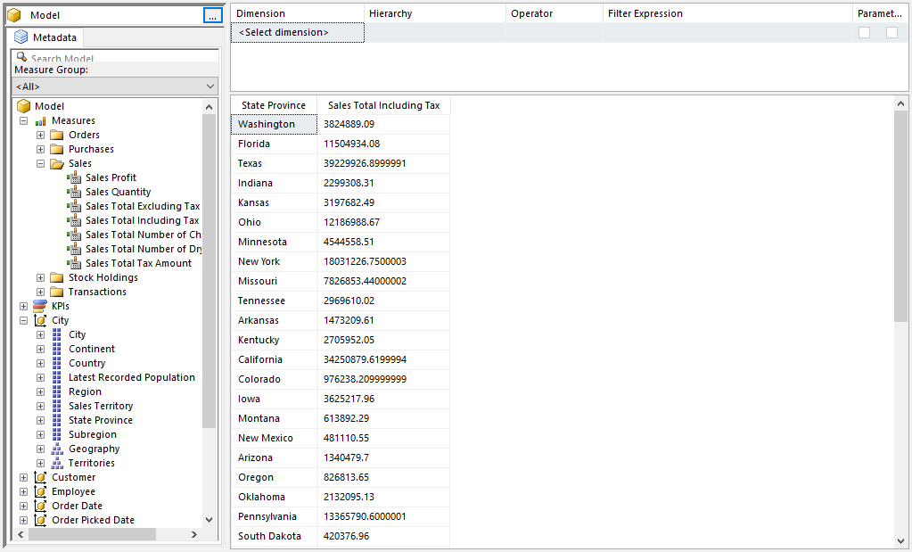
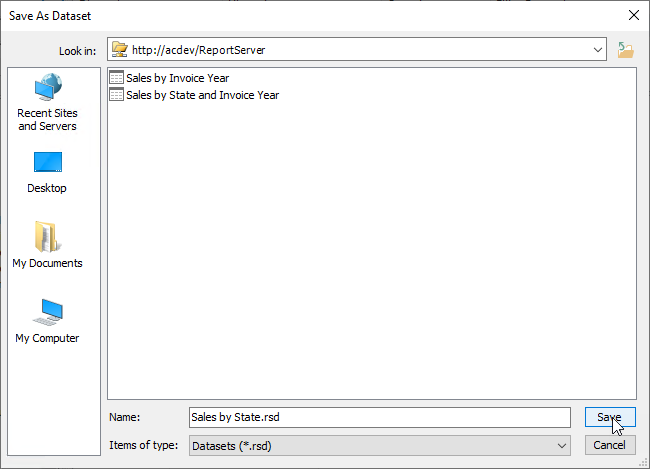

# Sales by State

## Introduction

These instructions walk you through the creation of the Sales by State dataset.

## Build the Query

First, move to the **City** branch. Expand it, then drag **State Province** to the query window.

In the **Measures** area, expand **Sales**. Click on **Sales Total Including Tax** and drag it into the query area at the very right.

Click the **Click to execute the query** link to ensure the query runs without issues.

## Save the query

Use the File menu, the pick Save.

In the **Look in** area of the dialog, make sure it is set to your report server. If not use the folder icon to the right in order to locate your server.

Name the file **Sales by State.rsd** then click Save.

## Conclusion

Close the Report Builder window.

Use the Refresh button on your browser to refresh the Report Portal page. You should now see your new dataset.
