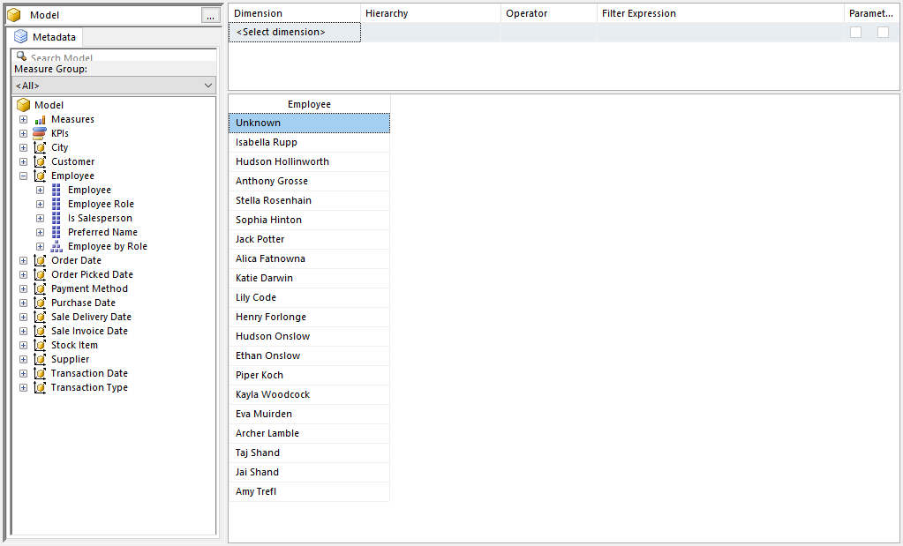
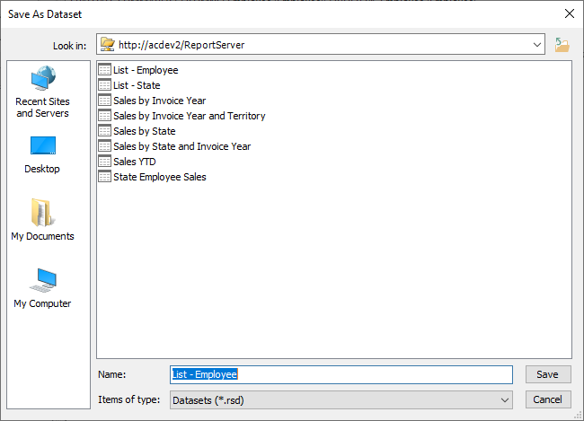

# List - Employee

## Introduction

These instructions walk you through the creation of the List Employee dataset.

## Launch the Dataset Designer

In the SQL Server Reporting Services Portal, click the New menu, then Dataset.

Your browser might prompt you that it is trying to open Microsoft Report Builder. If so click Open or OK.

You may be prompted that the report requires a connection to the report server, and warns you the connection may not be secure. This is typically the case when you have SQL Server installed on your local development box, and you can safely click Yes.

If you are in a corporate environment, you should check with your system administrator first.

The Report Builder now appears, with the dialog asking you to select a dataset. If you've run Report Builder before, the WWI Tabular dataset may already appear in the list. if so, you can click it then click Create.

If not, click on the _Browse other data sources_ link. The _Look in_ bar should default to the server you launched Report Builder from, for example _http://acdev2/ReportServer_. If not you can use the icon to the right of the _Look in_ bar to navigate to a server.

The dataset should appear in the list. If you are following the suggestions in these documents it would be named _WWI Tabular_. Click on it, then click _Open_.

It should now appear in the initial dialog. Now you can click _Create_.

You are now ready to build the query.

## Build the Query

First, move to the **Employee** branch. Expand it, then drag **Employee** to the query window.

Note that for this dataset we won't be using a measure. All we need is a simple list of all the employees in the cube. We will use this as a filter selection in one of the reports.

Click the **Click to execute the query** link to ensure the query runs without issues.



Note we have an issue though, the names are not in alphabetical order. We can fix this in our query, but will have to edit the DAX that report builder generates.

## Sorting the Output

In the query designers toolbar, click on the Design Mode button.


This will switch to a mode where you can edit the generated DAX query. Don't worry if you aren't fluent in DAX, this is a simple fix.

The generated query looks like:

```
EVALUATE SUMMARIZECOLUMNS('Employee'[Employee])
```
We simply need to add an `Order By` to the output, along with the column name to sort on.

```
EVALUATE SUMMARIZECOLUMNS('Employee'[Employee]) ORDER BY 'Employee'[Employee]
```

Be careful not to click the Design Mode button again, as it will regenerate the original query and you'll lose your modification!

At the bottom simply click Execute Query to test, and you should now see the results sorted by their first name.


## Save the query

Use the File menu, the pick Save.

In the **Look in** area of the dialog, make sure it is set to your report server. If not use the folder icon to the right in order to locate your server.

Name the file **List - Employee.rsd** then click Save.



## Conclusion

Close the Report Builder window.

Use the Refresh button on your browser to refresh the Report Portal page. You should now see your new dataset.
