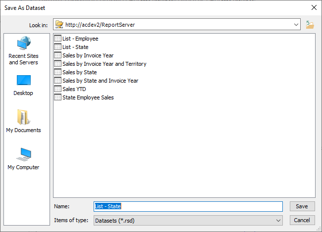

# State List

## Introduction

These instructions walk you through the creation of the State List dataset.

## Build the Query

First, move to the **City** branch. Expand it, then drag **State Province** to the query window.

Note that for this dataset we won't be using a measure. All we need is a simple list of all the States in the cube. We will use this as a filter selection in one of the reports.

Click the **Click to execute the query** link to ensure the query runs without issues.

## Save the query

Use the File menu, the pick Save.

In the **Look in** area of the dialog, make sure it is set to your report server. If not use the folder icon to the right in order to locate your server.

Name the file **State List.rsd** then click Save.

## Conclusion

Close the Report Builder window.

Use the Refresh button on your browser to refresh the Report Portal page. You should now see your new dataset.
