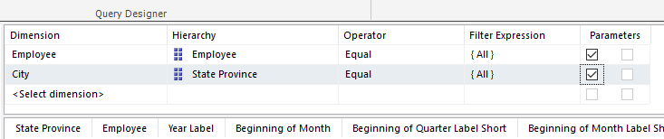

# State Employee Sales Details

## Introduction

This is an optional dataset. As part of the demos, we'll show how to use the "drill through" feature of Mobile Report Publisher. The publsisher has the ability to drill through to a paginated report.

As part of the project, I created a dataset to supply data to the paginated report. Creating the report is outside the scope of the course, but it is included in the downloads.

## Creating the Dataset

First, use the Report Portal to create a new dataset. Then, follow the instructions found in [01-State_Employee_Sales_Data.md](01-State_Employee_Sales_Data.md) up to the point where you hit Save.

Next, move to the area above the query results. In the column that reads _Dimension_, use the drop down to pick **Employee**.

Now move to the _Hierarchy_ column, use the drop down and pick **Employee**.

In the _Operator_, select **Equal** in the drop down.

Click in the _Filter Express_, and put a check in the box beside **All**.

Finally put a check in the left box under _Parameters_.

Now repeat the steps, using **City** for the dimension, **State Province** for the hierarchy, **Equal** for the operator, **All** for the filter expression, and put a check mark in the left parameter box.

The result should look like:



Next, we're going to use the same technique we used in the State and Employee datasets. We'll edit the DAX query to add an Order By statement. Click on the _Design Mode_ button.


The query that appears looks like quite a mess, but don't worry, we only need to make a few simple changes.

First, find the `EVALUATE` statement. Between it and the `SUMMARIZECOLUMNS`, put an opening parenthesis.

```sql
EVALUATE ( SUMMARIZECOLUMNS
```

Now move to the very end of the query, and place a closing parenthesis.

Next you'll add an `ORDER BY`. We want to order by the beginning month, so date related fields will sort correctly, then the employee, and finally state.

```sql
ORDER BY 'Sale Invoice Date'[Beginning of Month], 'City'[State Province], 'Employee'[Employee]
```

When done, your query should look like this:

```sql
DEFINE VAR vEmployeeEmployee1 = IF(PATHLENGTH(@EmployeeEmployee) = 1, IF(@EmployeeEmployee <> "", @EmployeeEmployee, BLANK()), IF(PATHITEM(@EmployeeEmployee, 2) <> "", PATHITEM(@EmployeeEmployee, 2), BLANK()))
VAR vEmployeeEmployee1ALL = PATHLENGTH(@EmployeeEmployee) > 1 && PATHITEM(@EmployeeEmployee, 1, 1) < 1
VAR vCityStateProvince1 = IF(PATHLENGTH(@CityStateProvince) = 1, IF(@CityStateProvince <> "", @CityStateProvince, BLANK()), IF(PATHITEM(@CityStateProvince, 2) <> "", PATHITEM(@CityStateProvince, 2), BLANK()))
VAR vCityStateProvince1ALL = PATHLENGTH(@CityStateProvince) > 1 && PATHITEM(@CityStateProvince, 1, 1) < 1
EVALUATE ( SUMMARIZECOLUMNS('City'[State Province], 'Employee'[Employee], 'Sale Invoice Date'[Year Label], 'Sale Invoice Date'[Beginning of Month], 'Sale Invoice Date'[Beginning of Quarter Label Short], 'Sale Invoice Date'[Beginning of Month Label Short], FILTER(VALUES('Employee'[Employee]), ((vEmployeeEmployee1ALL || 'Employee'[Employee] = vEmployeeEmployee1))), FILTER(VALUES('City'[State Province]), ((vCityStateProvince1ALL || 'City'[State Province] = vCityStateProvince1))), "Sales Total Including Tax", [Sales Total Including Tax]) )
ORDER BY 'Sale Invoice Date'[Beginning of Month], 'City'[State Province], 'Employee'[Employee]
```

Go ahead and execute your query, either by using the execute query blue text or the red exclamation mark in the toolbar.


## Save the Query

Assuming you've completed the work successfully, save the dataset as **State Employee Sales Details** to the server.

## Conclusion

This is the last of the datasets, with this done you are ready to start the dashboard design!
