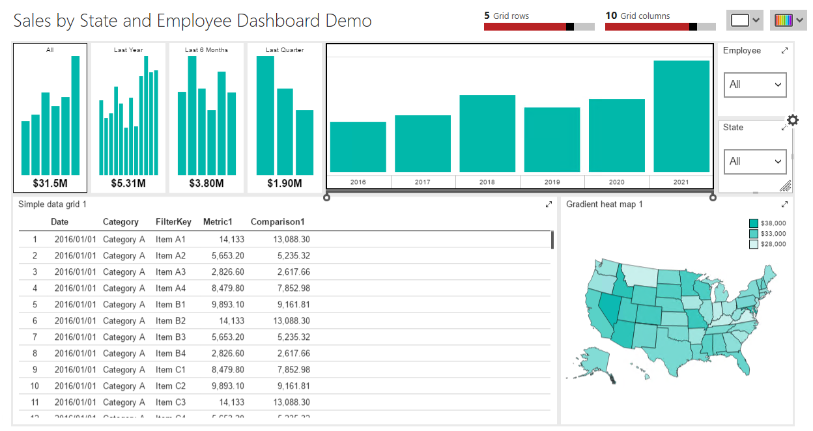

# Sales by State and Employee Dashboard

# Introduction

The files in this section instruct you on how to create the datasets for the "advanced" dashboard, named Sales by State and Employee Dashboard.

Above is the basic Sales Dashboard design. The instructions in these markdown files guide you through the creation of the datasets for each area.

# Datasets and controls

Unlike the basic dashboard, where each control has its own data source, with the advanced report all of the controls, except two, get their data from the [State Employee Sales Data](01-State_Employee_Sales_Data.md). 

The two exceptions are the Employee and State selection lists located in the upper right corner of the dashboard. The employee is sourced from [List - Employee](02-List_Employee.md), likewise state is derived from [List - State](03-List_state.md)
