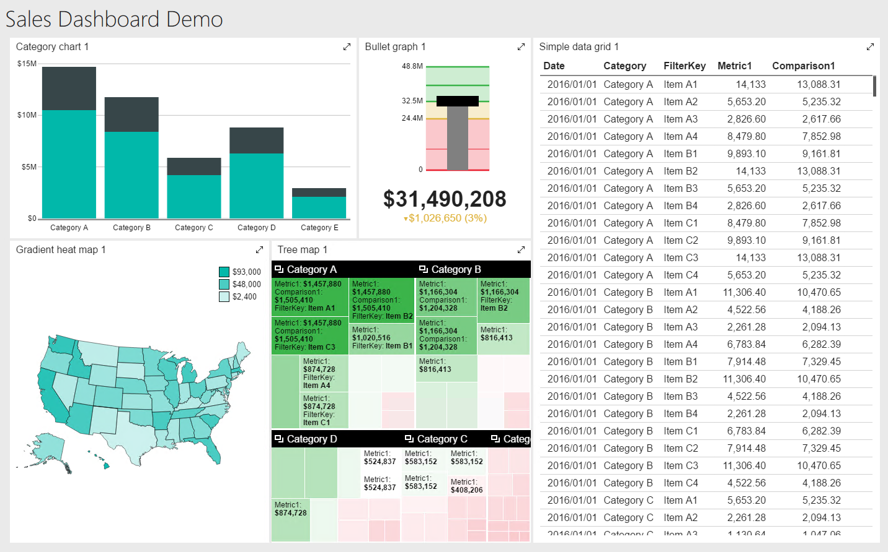

# Sales Dashboard Report

The files in this section instruct you on how to create the datasets for the "basic" dashboard, named Sales by Invoice Year.

Above is the basic Sales Dashboard design. The instructions in these markdown files guide you through the creation of the datasets for each area.

The files begin with a number, indicating the control to supply data to, starting left to right on the top row, then continuing left to right on the bottom row.

[01 - Sales by Invoice Year](01-Sales_by_Invoice_Year.md) - Category Chart, upper left.
